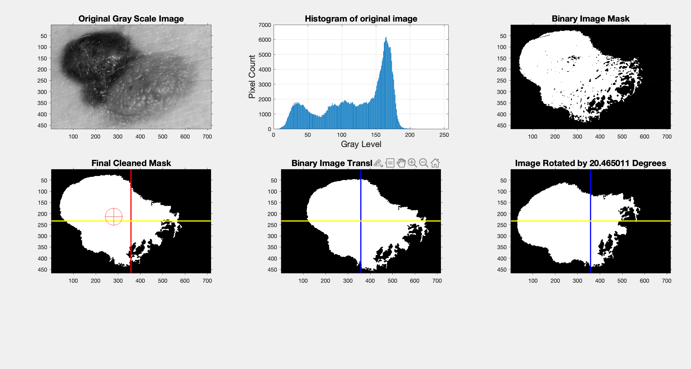

# Image Segmentation for Melanoma Detection

In digital image processing and computer vision, image segmentation is the process of partitioning a digital image into multiple segments (sets of pixels, also known as image objects). The goal of segmentation is to simplify and/or change the representation of an image into something that is more meaningful and easier to analyze.Image segmentation is typically used to locate objects and boundaries (lines, curves, etc.) in images. More precisely, image segmentation is the process of assigning a label to every pixel in an image such that pixels with the same label share certain characteristics.

{ width: 200px; }

The result of image segmentation is a set of segments that collectively cover the entire image, or a set of contours extracted from the image (see edge detection). Each of the pixels in a region are similar with respect to some characteristic or computed property, such as color, intensity, or texture. Adjacent regions are significantly different color respect to the same characteristic(s).[1] When applied to a stack of images, typical in medical imaging, the resulting contours after image segmentation can be used to create 3D reconstructions with the help of interpolation algorithms like marching cubes.
